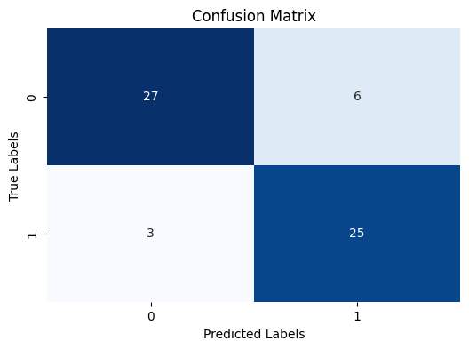
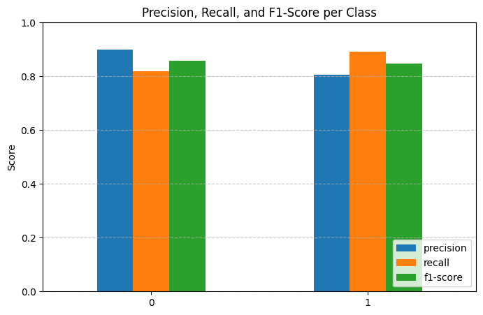

# 🫀 Heart Disease Prediction using Kernel SVM

This project predicts the likelihood of **heart disease** in patients using the **Cleveland Heart Disease dataset** and a **Kernel Support Vector Machine (SVM)** classifier.  
It’s part of my hands-on learning journey after completing the **Machine Learning A–Z** course on Udemy.

---

## 📘 Project Overview

This notebook demonstrates:
- End-to-end **classification workflow**
- Use of **Pipelines** for clean preprocessing
- **Kernel SVM** for non-linear decision boundaries
- **Model evaluation** using accuracy, confusion matrix, and classification report
- **Hyperparameter tuning** with `GridSearchCV`

---

## 🧩 Dataset

- **Name:** Cleveland Heart Disease Dataset  
- **Source:** [UCI Machine Learning Repository](https://archive.ics.uci.edu/dataset/45/heart+disease)  
- **Samples:** 303  
- **Target Variable:** `target` (1 = presence of heart disease, 0 = absence)  
- **Features Example:**
  - `age` – age in years  
  - `sex` – 1: male, 0: female  
  - `cp` – chest pain type (0–3)  
  - `trestbps` – resting blood pressure  
  - `chol` – serum cholesterol (mg/dl)  
  - `thalach` – maximum heart rate achieved  
  - … and more.

---

## ⚙️ Steps Performed

### **1. Data Loading & Exploration**
Loaded the dataset, checked missing values, and explored distributions.

### **2. Preprocessing**
- Split dataset into features and target  
- Standardized numeric features using `StandardScaler`  
- Used `Pipeline` to simplify preprocessing and model training

### **3. Model Training**
- Trained a **Kernel SVM (RBF)** classifier  
- Handled class imbalance using `class_weight='balanced'`

### **4. Model Evaluation**
Evaluated using:
- **Accuracy:** ~0.86  
- **Confusion Matrix & Classification Report**
- Visualized performance with heatmaps and metrics

### **5. Hyperparameter Tuning**
- Tuned parameters `C` and `gamma` using `GridSearchCV`
- Compared before/after tuning performance

### **6. Single Prediction**
Demonstrated how the model predicts a single patient case using input features.

---

## 📊 Results Summary

| Model | Description | Accuracy |
|:------|:-------------|:---------|
| Kernel SVM (default) | Balanced class weights | **0.8689** |
| Kernel SVM (after tuning) | Best parameters via GridSearch | **0.8525** |


**Classification Report (default model):**
| Metric | Precision | Recall | F1-Score |
|:--------|:-----------|:--------|:----------|
| No Disease (0) | 0.93 | 0.82 | 0.87 |
| Disease (1) | 0.81 | 0.93 | 0.87 |

---
## 🖼️ Visualization


&nbsp;



---
## 🧠 Key Learnings

- How to use **SVM with RBF kernel** for non-linear problems  
- The role of **`C`** and **`gamma`** in controlling the decision boundary  
- Importance of **feature scaling** for SVM performance  
- Using **Pipelines** to streamline workflow  
- Basic **hyperparameter optimization** with `GridSearchCV`

---

## 🧰 Tech Stack

- **Language:** Python 
- **Environment:** Google Colab  
- **Libraries:**  
  - `pandas`, `numpy`, `matplotlib`, `seaborn`  
  - `scikit-learn` (for SVM, preprocessing, metrics)

---

## 🚀 How to Run

1. Clone this repository  
   ```bash
   git clone https://github.com/<your-username>/heart-disease-svm.git
   cd heart-disease-svm
2. Open the notebook in Google Colab or Jupyter
3. Upload the dataset (heart.csv)
4. Run all cells sequentially
